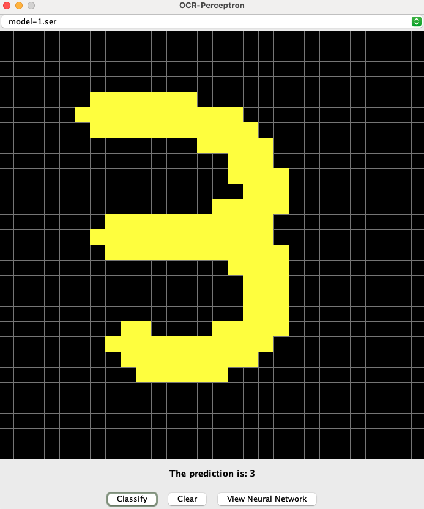

# OCR Perceptron

## Description
OCR (Optical Character Recognition) is a technique that a program can 
use to parse individual or stream images into a matched set of some written alphabet; 
often just a set of alphanumeric characters. OCR is used in banking, 
note taking applications, and many other services used on a daily basis. 
One of the most common implementations of OCR is the use of neural networks, 
often through supervised learning methods. This project aims to create a
really simple framework to test and train different implementations of fully connected
Neural Networks for the purposes of optical character recognition.

## Compiling the Project
